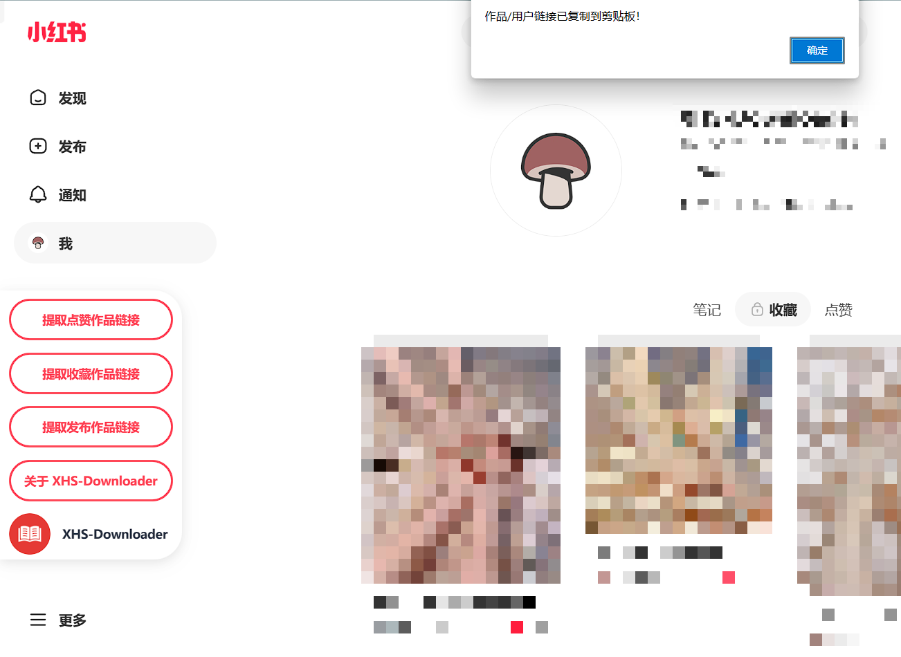

## 简介

基于XHS-Downloader二次开发的小红书工具。可以提取小红书作品/用户链接、下载小红书无水印图文/视频作品文件、下载笔记内容文本、图片笔记打包下载。

## 使用

如果您的浏览器安装了 Tampermonkey [https://www.tampermonkey.net/index.php](https://www.tampermonkey.net/index.php) 或者 脚本猫 [https://docs.scriptcat.org/](https://docs.scriptcat.org/) 浏览器扩展程序，
可以添加 用户脚本。

复制脚本 [XHS_script.js](XHS_script.js) 内容，粘贴到 Tampermonkey 中，保存即可。

原版 XHS-Downloader 脚本：[XHS-Downloader](https://greasyfork.org/zh-CN/scripts/465409-xhs-downloader)

脚本安装成功后，打开小红书页面，查看脚本说明，并根据提示操作。

提示：使用 XHS-Downloader 用户脚本批量提取作品链接，搭配 XHS-Downloader 程序可以实现批量下载无水印作品文件！

## 致谢

[XHS-Downloader](https://github.com/JoeanAmier/XHS-Downloader?tab=readme-ov-file)

## 版权

本项目遵循 [Apache License](LICENSE.txt) ，仅用于技术研究和学习，使用本项目时需遵守所在地法律法规、相关政策以及企业章程，禁止用于任何违法或侵犯他人权益的行为
